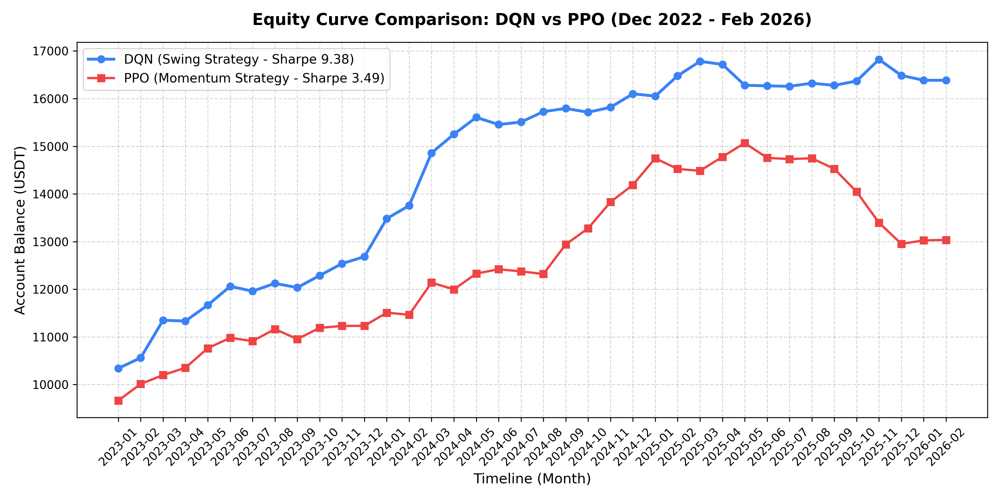
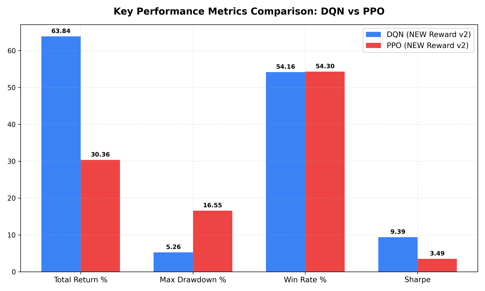
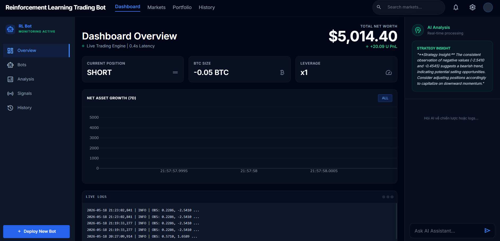

# Deep Reinforcement Learning for Bitcoin Trading

Dự án này ứng dụng công nghệ **Học tăng cường sâu (Deep Reinforcement Learning - DRL)** để tự động hóa giao dịch Bitcoin (BTC) tần suất cao. Khung hệ thống được lấy cảm hứng từ nghiên cứu: *"Reinforcement learning for bitcoin trading: A comparative study of PPO and DQN (Prasetyo et al., 2025)"* với mục tiêu kiểm soát tối ưu trong thị trường tài chính không dừng (Non-Stationary).

---

##  Các Kỹ Thuật Nổi Bật (Key Techniques)

### 1. Thuật Toán Cốt Lõi (Core RL Algorithms)
* **DQN (Deep Q-Network - Thiên về Swing Trading & Lọc nhiễu):** 
  
* **PPO (Proximal Policy Optimization - Thiên về Momentum Trading):** 
  

### 2.  Xử Lý Tín Hiệu (Advanced Feature Engineering)
* **Chuẩn hóa Z-Score Cục bộ (Rolling Normalization):**
  
* **Bộ lọc xu hướng (Regime Filter):**
  

### 3.  Định Hình Phần Thưởng Độc Quyền (Premium Reward Shaping)
* **Asymmetric Realized Reward (Phạt cắt lỗ bất đối xứng):**
  

* **Max Drawdown Penalty (Hình phạt sụt giảm tài sản tối đa):**
  
### 4.  Không gian Hành động (Action Spaces Mapping)
Để tối ưu hóa hành vi giao dịch và phí giao dịch, không gian hành động được xây dựng chuyên biệt cho từng mô hình:
* **DQN (Discrete 4 Action Space):**
  * `0 = WAIT` (Giữ nguyên vị thế hiện tại, không thay đổi, **không phát sinh phí**).
  * `1 = LONG` (Mở vị thế mua hoặc đóng Short để chuyển sang Long, target position = +1.0).
  * `2 = SHORT` (Mở vị thế bán khống hoặc đóng Long để chuyển sang Short, target position = -1.0).
  * `3 = CLOSE` (Đóng toàn bộ vị thế hiện tại về Flat để chốt lời/cắt lỗ chủ động, target position = 0.0).
* **PPO (Discrete 3 Action Space - Chuẩn Paper):**
  * `0 = SHORT` (Đặt vị thế đích mong muốn = -1.0).
  * `1 = FLAT` (Đặt vị thế đích mong muốn = 0.0, đóng vị thế về 0, đứng ngoài thị trường).
  * `2 = LONG` (Đặt vị thế đích mong muốn = +1.0).
  

### 5.  Hàm Phần Thưởng Toán Học (Mathematical Reward Function)
Hệ thống sử dụng hàm định hình phần thưởng động lượng kết hợp quản lý rủi ro nâng cao dựa trên nghiên cứu khoa học:

#### A. Running Reward (Phần thưởng duy trì mỗi bước nến - Eq. 8 Paper):
Tại mỗi bước thời gian $t$, phần thưởng duy trì được tính toán theo PnL tài khoản thực tế trừ đi chi phí giao dịch phát sinh:
$$R(t) = \left( r(t) \cdot A(t) \cdot \lambda - |A(t) - A(t-1)| \cdot C \cdot \lambda + \text{ShortBonus} \right) \cdot \text{scaling}$$
Trong đó:
* $r(t) = \ln(P_t / P_{t-1})$: Log-return biến động giá của tài sản tại thời điểm $t$.
* $A(t) \in \{-1, 0, +1\}$: Trạng thái vị thế của Agent tại bước $t$ (Short / Flat / Long).
* $C$: Basis points phí giao dịch ảo dùng để phạt hành vi đổi chiều liên tục (`transaction_cost`).
* $\lambda = \text{Leverage} \times \text{Max Capital Usage}$: Hệ số đưa biến động phần trăm giá trị tài sản về đúng mức biến động thực tế của tài khoản.
* $\text{ShortBonus}$: Phần thưởng khuyến khích mở lệnh Short khi thị trường trong xu hướng tăng (Uptrend) để hạn chế triệt để hiện tượng bot bị nghiêng hẳn về một chiều (Long-bias).
* $\text{scaling}$: Hệ số khuếch đại tín hiệu giúp mạng phê bình (Critic Network) hội tụ nhanh hơn.


---

##  Hướng dẫn Cài đặt & Chạy

### 1. Cài đặt Môi trường
Cài đặt các thư viện phụ thuộc bằng `pip`:
```bash
pip install -r requirements.txt
```

### 2. Chuẩn bị Dữ liệu (Data Pipeline)
Hệ thống yêu cầu dữ liệu lịch sử để huấn luyện và kiểm thử.
- **Thu thập dữ liệu (Fetch Data):** Tải dữ liệu nến (OHLCV) từ sàn giao dịch (ví dụ: Binance) về thư mục `data/raw/`.
```bash
python src/data/data_loader.py
# hoặc
python src/data/fetch_hist_5m.py
```
- **Xử lý dữ liệu (Preprocess & Feature Engineering):** Tính toán các chỉ báo kỹ thuật (RSI, MACD, Volatility), tạo nhãn xu hướng (Trend) và chuẩn hóa Z-Score. Dữ liệu đầu ra lưu tại `data/processed/`.
```bash
python src/data/preprocess_mar2026.py
# hoặc tính toán features tổng quát
python src/data/features_full.py
```

### 3. Huấn luyện Mô hình (Train)
Huấn luyện mô hình từ đầu với cấu hình được quy định trong `config.yaml`:
```bash
python src/train.py
```

### 4. Kiểm thử Mô hình (Backtest)
Chạy backtest để kiểm tra tỷ lệ Win/Loss, Sharpe Ratio, Profit Factor trên tệp dữ liệu kiểm thử:
```bash
# Backtest mô hình theo cấu hình mặc định
python src/backtest.py

# Backtest so sánh bộ reward cũ và mới
python src/backtest.py --compare
```

####  Kết Quả Backtest Thực Tế & Phân Tích (Dec 2022 - Feb 2026)
Hệ thống đã thực hiện kiểm thử lịch sử (Backtest) dài hạn trên dữ liệu thực tế khung 1h của cặp BTCUSDT từ **31/12/2022** đến **01/02/2026**. Kết quả cho thấy sự chênh lệch hiệu năng cực lớn giữa hai trường phái thuật toán và chiến lược:

| Chỉ số hiệu suất (Metric) | Mô hình DQN (Swing Strategy) | Mô hình PPO (Momentum Strategy) | Đánh giá & So sánh |
| :--- | :---: | :---: | :--- |
| **Tổng lợi nhuận (Total Return %)** | **`+63.84%`** | **`+30.36%`** | **DQN vượt trội gấp 2.1 lần** |
| **Sụt giảm tối đa (Max Drawdown %)**| **`5.26%`** | **`16.55%`** | **DQN an toàn gấp 3.1 lần** |
| **Chỉ số Sharpe (Sharpe Ratio)** | **`9.38`** | **`3.49`** | **Cả hai đều có Sharpe xuất sắc, nhưng DQN vượt trội** |
| **Tỷ lệ thắng (Win Rate %)** | **`54.16%`** | **`54.30%`** | Tương đương nhau |
| **Số lượng giao dịch (N Trades)** | **`2,851`** | **`1,674`** | DQN giao dịch năng động hơn khi có xu hướng rõ ràng |
| **Tỷ lệ đứng ngoài (Flat %)** | **`73.0%`** | **`6.2%`** | **Sự kiên nhẫn làm nên chiến thắng** |
| **Hệ số lợi nhuận (Profit Factor)** | **`1.836`** | **`1.299`** | DQN mang lại dòng tiền ròng tối ưu hơn |

> [!NOTE]
> **Quy mô vị thế & Quản lý vốn trong Backtest:**
> * **Số vốn ban đầu (Initial Balance):** $10,000 USDT.
> * **Tiền ký quỹ trên mỗi lệnh (Margin per trade):** Cố định ở mức **`2%`** số dư ví tài khoản tại thời điểm mở lệnh (`max_capital_usage: 0.02`).
> * **Đòn bẩy áp dụng (Leverage):** **`x10`**.
> * **Quy mô vị thế danh nghĩa (Nominal Position Size):** Bằng **`20%`** tổng giá trị tài khoản ròng tại thời điểm đó (tức là $2\% \text{ Margin} \times 10 \text{ Leverage} = 20\% \text{ Position Size}$).
> * **Khối lượng đi lệnh thực tế ở vạch xuất phát:** Với tài khoản `$10,000` USDT, quy mô vị thế danh nghĩa là **`$2,000 USDT`** (tương đương **`~0.026 BTC`** tại mức giá BTC khoảng `$77,000` USDT). Khối lượng này tự động tăng/giảm tỷ lệ thuận theo sự tăng trưởng của số dư tài khoản (cơ chế **Lãi kép / Compound Interest**).

####  Trực quan hóa đường cong vốn & Chỉ số hiệu suất

*Hình 1: Biểu đồ tăng trưởng tài khoản (Equity Curve) của DQN và PPO từ vốn ban đầu $10,000.*


*Hình 2: So sánh trực quan giữa các chỉ số chính: Tổng lợi nhuận %, Sụt giảm tối đa %, Tỷ lệ thắng % và chỉ số Sharpe.*


---

### 5. Chạy Bot Thực tế (Live)
Khởi chạy bot giao dịch tự động thời gian thực:
```bash
python -u src/run_agent.py
```

### 6. Khởi động Giao diện Quản lý (Dashboard)
Chạy giao diện giám sát Bot Trading:
```bash
uvicorn dashboard.server:app --reload
```
Vào localhost: http://127.0.0.1:8000/

####  Giao diện Giám sát thời gian thực (Real-time Dashboard)

*Hình 3: Giao diện web trực quan hiển thị số dư tài sản ròng, vị thế hiện tại, lịch sử số dư (Equity Curve) và nhật ký giao dịch (Live Logs) thời gian thực.*
